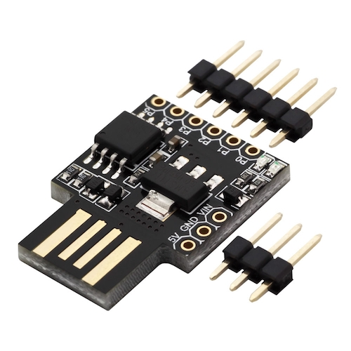

# ir_hid

USB universal IR receiver that simulates HID input (Keyboard, Consumer) and can be configured using Web interface (WebUSB)

# Build

Build as a standard AVR program - avr-gcc and cmake is required.
```bash
cmake -B build -S .
cmake --build build
```

Firmware is available at `build/ir_hid.hex` 

(For ATmega328p CMakeLists.txt must be modified.)

To flash:
1. Get [Micronucleus](https://github.com/micronucleus/micronucleus) 
2. `micronucleus --run build/ir_hid.hex`
3. Insert the board to USB port.

# Hardware

Any ATmega328p (Arduino UNO) or ATtiny85 (Digispark board) board should work. 

Digispark board is recommended (less than $2 on AliExpress, has micronucleus bootloader built-in).

On ATTiny85 connect IR receiver (TSOP1736 or any other) to pin 0 (PB0).



# Configuration app

[Configuration webapp](https://jaczekanski.github.io/ir_hid/)

or build manually

```bash
cd web
npm install
npm run dev
```
Visit localhost:5000

Automatic builds and deployment to GitHub pages will be added in the future.

# Author
Jakub Czekański

# License
MIT